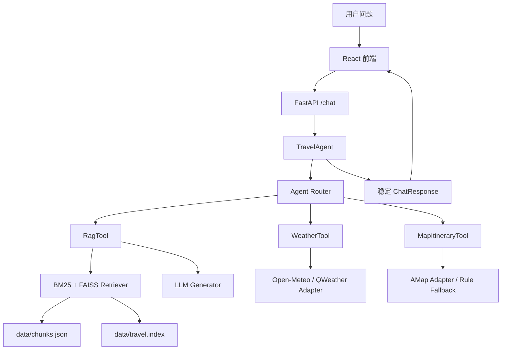

# 智能旅游 RAG Agent

这是一个基于 Python、FAISS、LLM、FastAPI 和 React 的智能旅游 Agent 系统。项目从本地结构化旅游知识库出发，保留 RAG 主线，并在 V4-V6 阶段加入单 Agent 工具路由、天气工具、地图行程工具、前端展示和服务器部署说明。

结构清晰、接口稳定、RAG 与工具调用，暂时不做复杂多智能体、不接爬虫、不做酒店/航班实时价格、不做登录注册。

## 技术栈

- 后端：Python、FastAPI、Pydantic、httpx
- RAG：FAISS、sentence-transformers、本地 chunks、BM25 + 向量混合召回
- LLM：OpenAI-compatible SDK，可接 Qwen、DeepSeek 等
- 工具：RagTool、WeatherTool、MapItineraryTool
- 前端：Vite、React、TypeScript、CSS
- 部署：venv + uvicorn，Docker 可选

## 系统架构



## RAG + Agent 工作流

1. `app.main` 接收 `/chat` 请求。
2. `TravelAgent.analyze_query` 提取 city、category、intent、days、places。
3. `AgentRouter.route_task` 选择工具。
4. `execute_tool` 调用 `rag_tool`、`weather_tool`、`map_itinerary_tool` 或拒答。
5. `generate_final_answer` 整合工具结果，返回稳定响应。

支持 intent：

- `knowledge_qa`
- `food_recommendation`
- `itinerary_plan`
- `transport_advice`
- `realtime_weather`
- `map_route_plan`
- `realtime_opening_hours`
- `unsupported`

实时开放时间、实时票价、酒店价格、航班价格没有对应工具时不会用 RAG 编造，会返回“根据当前资料，我无法确认。”

## 目录结构

```text
TRAVELAGENT/
├── app/
│   ├── main.py
│   ├── config.py
│   ├── schemas.py
│   ├── agents/
│   │   ├── travel_agent.py
│   │   ├── router.py
│   │   └── state.py
│   ├── tools/
│   │   ├── rag_tool.py
│   │   ├── weather_tool.py
│   │   └── map_itinerary_tool.py
│   ├── rag/
│   │   ├── build_index.py
│   │   ├── loader.py
│   │   ├── retriever.py
│   │   ├── prompt.py
│   │   ├── generator.py
│   │   └── pipeline.py
│   └── utils/
│       └── logger.py
├── data/
│   ├── knowledge/travel_knowledge.json
│   ├── chunks.json
│   └── travel.index
├── frontend/
├── scripts/
│   └── rebuild_index.py
├── Dockerfile
├── docker-compose.yml
└── README.md
```

## 知识库说明

- 原始知识库：`data/knowledge/travel_knowledge.json`
- 构建产物：`data/chunks.json`
- FAISS 索引：`data/travel.index`

每次更新 knowledge 后运行：

```bash
python scripts/rebuild_index.py
```

chunk metadata 会保留：`id`、`city`、`province`、`country`、`category`、`title`、`tags`、`suitable_for`、`updated_at`、`source_type`。

## 工具说明

### RagTool

封装现有 RAG Pipeline，适合稳定旅游知识、美食、景点、交通、旅行建议。

输出包含：`answer`、`confidence`、`sources`、`refused`。

### WeatherTool

默认 provider 是 Open-Meteo，无需 API Key，适合原型演示。工具内置了常见城市经纬度映射，覆盖成都、重庆、北京、上海、杭州、西安、南京、苏州、广州、深圳、厦门、青岛、长沙、武汉、昆明、三亚、东京、大阪、京都、首尔、新加坡、曼谷、巴黎、伦敦。

如果天气 API 失败，Agent 会明确说明“实时天气暂时无法确认”，不会编造天气。

### MapItineraryTool

支持轻量行程顺序建议。配置 AMap Key 后可尝试地理编码；未配置时使用知识库和规则降级生成行程。不会编造精确路程、精确耗时或实时拥堵。

## 环境变量

复制 `.env.example` 为 `.env`，不要把 `.env` 提交到 GitHub。

关键配置：

```text
LLM_PROVIDER=qwen
LLM_API_KEY=your_llm_api_key
LLM_BASE_URL=your_llm_base_url
LLM_MODEL=your_chat_model

EMBEDDING_PROVIDER=local
EMBEDDING_MODEL=BAAI/bge-m3

KNOWLEDGE_PATH=data/knowledge/travel_knowledge.json
CHUNKS_PATH=data/chunks.json
FAISS_INDEX_PATH=data/travel.index

WEATHER_PROVIDER=open_meteo
WEATHER_BASE_URL=https://api.open-meteo.com
QWEATHER_API_KEY=your_qweather_api_key

MAP_PROVIDER=amap
AMAP_API_KEY=your_amap_api_key

FRONTEND_ORIGIN=http://localhost:5173
```

## 后端启动

Windows 本地：

```bash
python -m venv venv
venv\Scripts\activate
pip install -r requirements.txt
python scripts\rebuild_index.py
uvicorn app.main:app --reload
```

Linux / 阿里云：

```bash
python -m venv venv
source venv/bin/activate
pip install -r requirements.txt
python scripts/rebuild_index.py
uvicorn app.main:app --host 0.0.0.0 --port 8000
```

访问：

```text
http://127.0.0.1:8000/docs
http://127.0.0.1:8000/health
```

## 前端启动

```bash
cd frontend
npm install
npm run dev
```

访问：

```text
http://localhost:5173
```

前端只调用后端 `/chat`，不会实现 RAG、天气或地图逻辑。

## API 示例

### GET /health

响应：

```json
{
  "status": "ok",
  "service": "travel-agent"
}
```

### POST /chat

请求：

```json
{
  "question": "成都明天适合去人民公园吗？",
  "session_id": "optional-session-id"
}
```

响应：

```json
{
  "answer": "最终回答",
  "session_id": "会话 ID",
  "intent": "realtime_weather",
  "selected_tool": "weather_tool",
  "confidence": 0.82,
  "sources": [],
  "refused": false
}
```

## 示例问题

- 成都适合喜欢美食和慢节奏旅行的人吗？
- 北京三天怎么玩？
- 成都明天适合去人民公园吗？
- 上海适合购物还是历史文化游？
- 东京迪士尼今天几点开门？
- 大阪和京都怎么安排三日游？

## Docker 部署

```bash
docker build -t travel-agent .
docker run -d --name travel-agent -p 8000:8000 --env-file .env travel-agent
```

或使用：

```bash
docker compose up -d --build
```

## 阿里云部署说明

服务器信息：


公网演示地址示例：

```text
http://47.107.173.148:8000/docs
```

部署注意：

1. 后端服务需要绑定 `0.0.0.0`。
2. 阿里云安全组需要开放 `8000` 端口，或使用 Nginx 转发到 `80/443`。
3. 暂时没有域名时，可以先使用公网 IP + 端口演示。
4. 私网 IP 只用于服务器内部网络信息，不作为公网访问地址。
5. 不要把服务器密码、SSH 私钥、真实 API Key 写入 README 或代码。
6. `.env` 不要提交到 GitHub。

可选 Nginx 思路：前端静态文件由 Nginx 托管，`/api` 反向代理到 `127.0.0.1:8000`。

## 当前限制

- Open-Meteo 使用内置城市经纬度表，未覆盖城市会降级。
- 地图工具是轻量版，不提供实时拥堵和精确耗时。
- 实时开放时间、实时票价、酒店价格、航班价格暂不支持。
- 会话只通过 `session_id` 透传，没有数据库持久化。
- RAG 质量依赖知识库内容和索引重建。

## 后续优化方向

- 接入更完整的天气和地图 provider。
- 引入真实 reranker 模型。
- 增加 JSONL tracing 或 Langfuse 观察链路。
- 扩展 Eval 集，覆盖更多城市和意图。
- 前端增加检索过程调试面板。
